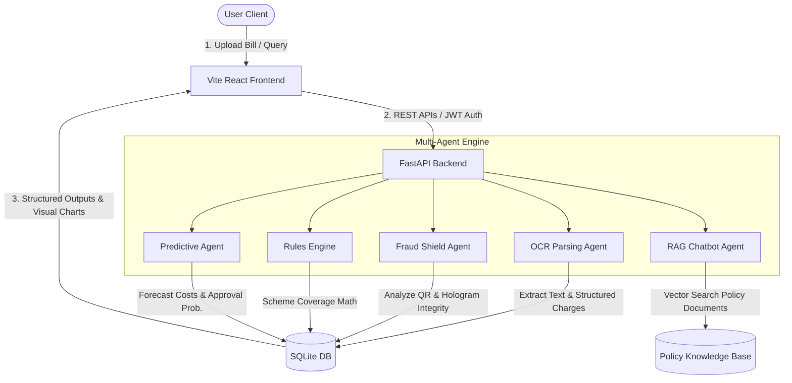
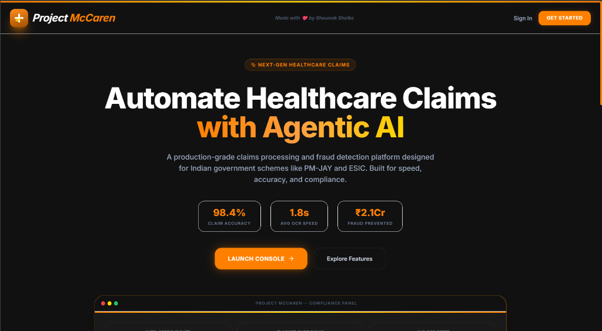
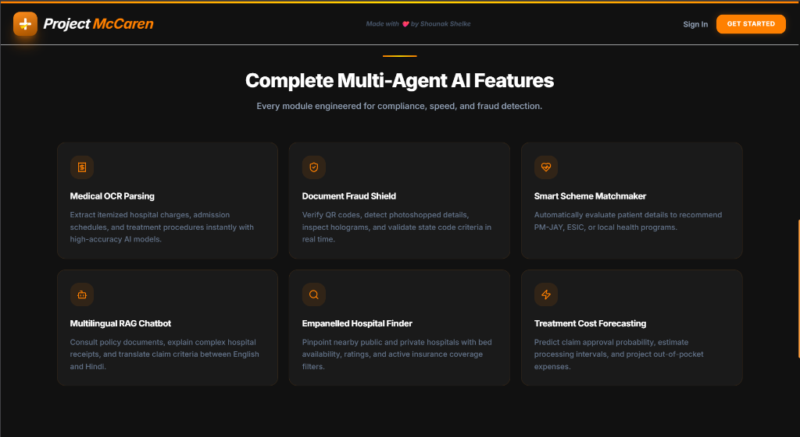
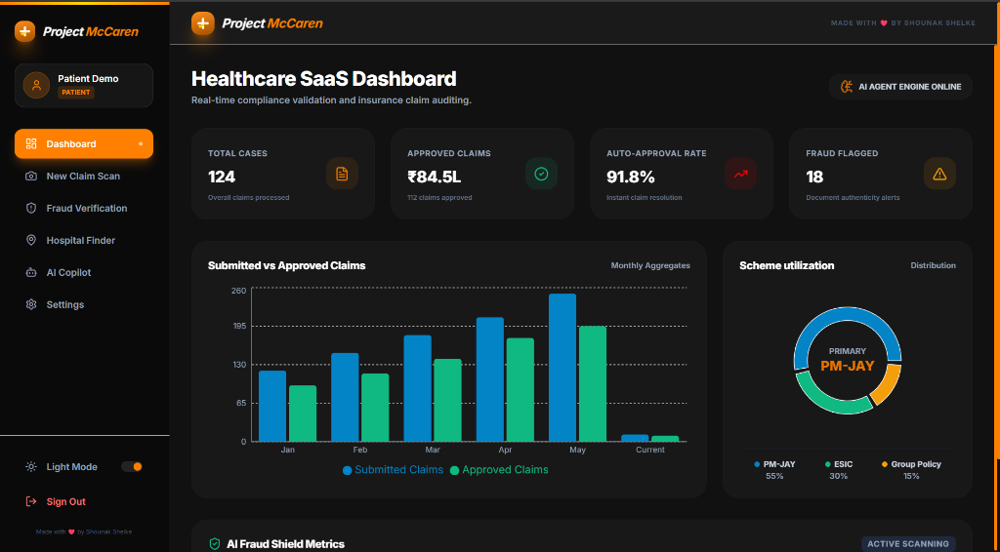
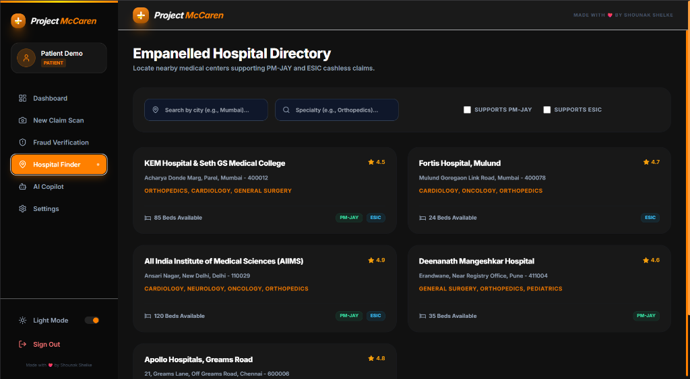
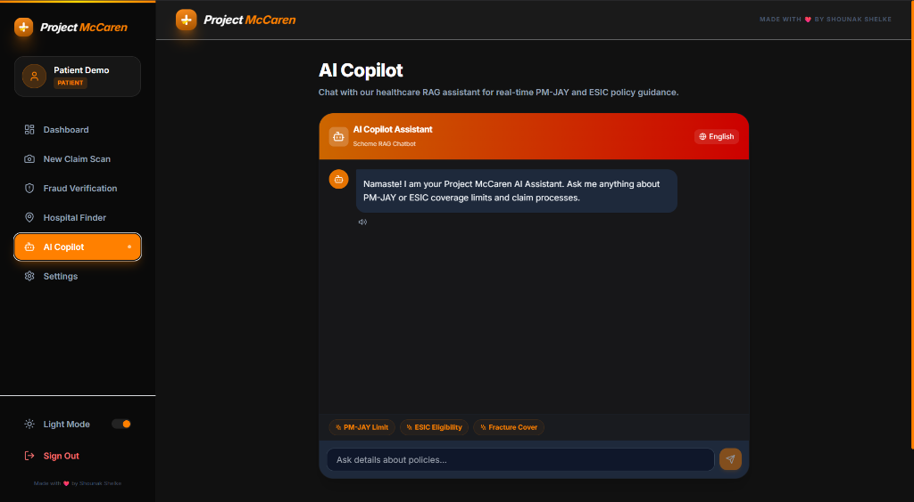

# Project McCaren AI Healthcare Platform

Project McCaren is AI-powered healthcare claims processing, fraud detection, and compliance platform tailored for the Indian healthcare ecosystem. The platform is designed to automate and streamline claims auditing, policy compliance, and package matching for public government schemes such as the Pradhan Mantri Jan Arogya Yojana (PM-JAY) and the Employees' State Insurance Corporation (ESIC).

By leveraging a multi-agent artificial intelligence architecture, Project McCaren enables real-time Optical Character Recognition (OCR) billing analysis, automated document integrity and security scanning, predictive treatment cost forecasting, and an intelligent policy Retrieval-Augmented Generation (RAG) assistant.

---

## Architecture and Data Flow

Project McCaren uses a decoupled monorepo architecture with a high-performance Python FastAPI backend serving as the orchestration layer for specialized AI agents, and a modern, responsive Vite React application as the presentation console.



---

## Visual Showcase

### 1. Landing Platform and Landing Mockup
The entry point features clean, typography-focused hero sections with real-time claim speed statistics and an interactive device mockup showcasing the compliance panel.



### 2. Multi-Agent Feature Suite
The landing console provides direct insights into the six core operational modules engineered for compliance, speed, and safety.



### 3. Healthcare SaaS Dashboard
The primary dashboard serves as a central hub for medical directors and auditors, illustrating total processed cases, approved volumes, real-time approval rates, and custom Recharts analytics demonstrating scheme distribution and monthly approval trends.



### 4. Empanelled Hospital Directory
A searchable, database-backed mapping dashboard that enables patients and providers to filter hospitals by city, specialty, and supported government scheme.



### 5. AI Copilot RAG Assistant
A bilingually-engineered (English and Hindi) chat panel that utilizes Retrieval-Augmented Generation to consult official policy books, generate answers with direct document citations, and provide voice synthesis capabilities.



---

## Core Feature Modules

### Medical OCR Billing Parser
- Utilizes high-accuracy Optical Character Recognition (OCR) paired with regular expression parsing heuristics.
- Automatically extracts itemized hospital fees, treatment names, admission timelines, and discharge summaries.
- Converts raw medical invoices into standardized, queryable schema data structures.

### Document Fraud Shield
- Runs digital document authenticity scanning on public benefit cards (PM-JAY and ESIC).
- Verifies embedded QR codes, scans for hologram details, and detects photo-manipulation anomalies.
- Flags suspicious cases with detailed rationale alerts directly on the auditor console.

### Smart Scheme Matchmaker
- Performs algorithmic package evaluation based on patient state codes, income thresholds, and treatment requirements.
- Automatically calculates policy eligibility percentages, maximum allowed caps, and patient co-pay calculations using shared schema rules.

### Treatment Cost Forecasting
- Models treatment cost variations based on historical package rates.
- Predicts claim approval probabilities in real time using metrics such as OCR scan confidence and card validation scores.
- Projects out-of-pocket expenses for patients before discharge.

### Empanelled Hospital Directory
- Fast, index-optimized search parameters allowing users to locate public and private hospitals.
- Filters hospitals by scheme support (PM-JAY or ESIC), bed availability, regional cities, and clinical specialties.

---

## Role-Based Access Control

Project McCaren features a secure, token-based authentication system supporting three separate user personas, each accessing tailored dashboard panels:

1. **Admin / Auditor**: Accesses the "Admin Audits" panel containing comprehensive historical claims. Auditors can manually approve or reject pending insurance claims, directly writing decision logs to the persistent audit database.
2. **Provider (Hospital)**: Accesses the "New Claim Scan" interface to upload bills, run OCR and fraud checks, and view predicted cost forecasts before submitting claims for reimbursement.
3. **Patient**: Accesses the "Hospital Finder" and the "AI Copilot" RAG helper to query coverage rules, search nearby treatment centers, and verify eligibility details.

### Quick Demo Access Credentials
The application is pre-seeded with instant one-click login accounts matching the backend database:
- **Admin**: email: `admin@project-mccaren.com` | password: `admin123`
- **Provider**: email: `provider@project-mccaren.com` | password: `provider123`
- **Patient**: email: `patient@project-mccaren.com` | password: `patient123`

---

## Technology Stack

### Frontend Architecture
- **Framework**: React 19 with Vite and TypeScript.
- **Styling**: TailwindCSS with premium glassmorphism styling and smooth layout transitions.
- **State Management**: Zustand for light, reactive global user states.
- **Data Querying**: TanStack React Query for cached, robust API request handling.
- **Data Visualization**: Recharts for clean, responsive SVG data charts.
- **Icons**: Lucide React.

### Backend Infrastructure
- **Framework**: FastAPI (Python 3.11+) offering high-throughput performance.
- **Database Engine**: SQLAlchemy ORM with SQLite database integration.
- **Security**: OAuth2 with JWT (JSON Web Tokens) encryption and secure password hashing via CryptContext.
- **AI Processing**: Tesseract OCR engine, regular expression parsers, and custom machine learning heuristic models.

---

## Installation and Execution Guide

### Prerequisites
- Python 3.11 or higher installed on your system.
- Node.js (v18 or higher) and npm package manager installed.

### Standard Startup
The project includes a startup launcher script that automates backend environment setup, dependency installations, database migrations, and frontend service launches.

Run the following command in the root folder of the project:
```bash
start.bat
```

### Manual Backend Setup
1. Navigate to the backend directory:
   ```bash
   cd backend
   ```
2. Create and activate a Python virtual environment:
   ```bash
   python -m venv venv
   source venv/bin/activate  # On Windows use: venv\Scripts\activate
   ```
3. Install the required dependencies:
   ```bash
   pip install -r requirements.txt
   ```
4. Run the database migrations:
   ```bash
   alembic upgrade head
   ```
5. Launch the FastAPI server:
   ```bash
   uvicorn backend.app.main:app --host 127.0.0.1 --port 8000 --reload
   ```

### Manual Frontend Setup
1. Navigate to the frontend directory:
   ```bash
   cd apps/web
   ```
2. Install the node modules:
   ```bash
   npm install --legacy-peer-deps
   ```
3. Launch the Vite development server:
   ```bash
   npm run dev
   ```
4. Open your browser and navigate to the application:
   ```
   http://localhost:5173
   ```

---

## Compliance and Security Standard
The platform integrates robust HIPAA-compliant data security protocols:
- Secure JWT-based session expiration.
- Complete data encryption in transit.
- Comprehensive database logs recording audit trails for all critical actions including OCR scans, claims evaluations, and status modifications.

---

## Developer Attribution
Developed and engineered by Shounak Shelke. All rights reserved.
